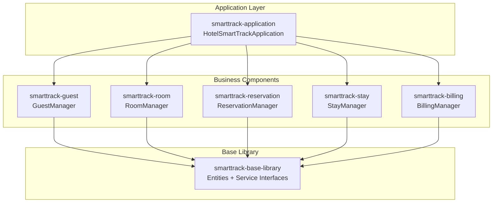

# Hotel SmartTrack - Spring Boot + OSGi Setup Guide

This guide provides comprehensive instructions for setting up the Hotel SmartTrack system using **Spring Boot 4.0.1** with **OSGi modularity** via Apache Felix maven-bundle-plugin.

---

## Table of Contents

1. [Project Overview](#project-overview)
2. [Technology Stack](#technology-stack)
3. [Project Structure](#project-structure)
4. [Quick Start](#quick-start)
5. [Module Configuration](#module-configuration)
6. [OSGi Bundle Configuration](#osgi-bundle-configuration)
7. [CBSE Rules Implementation](#cbse-rules-implementation)
8. [Running the Application](#running-the-application)
9. [Troubleshooting](#troubleshooting)

---

## Project Overview

The Hotel SmartTrack System is a component-based hotel management system designed following **CBSE (Component-Based Software Engineering)** principles. The system is composed of:

- **Base Library**: Contains shared entity classes and service interfaces
- **5 Business Components**: Guest, Room, Reservation, Stay, and Billing management
- **Application Module**: Main Spring Boot application entry point

### Component Architecture



---

## Technology Stack

| Component         | Technology                | Version |
| ----------------- | ------------------------- | ------- |
| **Framework**     | Spring Boot               | 4.0.1   |
| **Build Tool**    | Apache Maven              | 3.9+    |
| **OSGi Bundling** | maven-bundle-plugin       | 5.1.9   |
| **Java**          | OpenJDK                   | 17+     |
| **ORM**           | JPA (Jakarta Persistence) | 3.x     |

---

## Project Structure

```
hotel-smarttrack/
├── pom.xml                              # Parent POM
│
├── smarttrack-base-library/             # Shared entities & interfaces
│   ├── pom.xml
│   └── src/main/java/com/hotelsmarttrack/base/
│       ├── entity/                      # 8 Entity classes
│       │   ├── Guest.java
│       │   ├── Room.java
│       │   ├── RoomType.java
│       │   ├── Reservation.java
│       │   ├── Stay.java
│       │   ├── Invoice.java
│       │   ├── Payment.java
│       │   └── IncidentalCharge.java
│       └── service/                     # 5 Service interfaces
│           ├── GuestService.java
│           ├── RoomService.java
│           ├── ReservationService.java
│           ├── StayService.java
│           └── BillingService.java
│
├── smarttrack-guest/                    # Guest Management Component
│   ├── pom.xml
│   └── src/main/java/.../guest/GuestManager.java
│
├── smarttrack-room/                     # Room Management Component
│   ├── pom.xml
│   └── src/main/java/.../room/RoomManager.java
│
├── smarttrack-reservation/              # Reservation Management Component
│   ├── pom.xml
│   └── src/main/java/.../reservation/ReservationManager.java
│
├── smarttrack-stay/                     # Stay Management Component
│   ├── pom.xml
│   └── src/main/java/.../stay/StayManager.java
│
├── smarttrack-billing/                  # Billing & Payment Component
│   ├── pom.xml
│   └── src/main/java/.../billing/BillingManager.java
│
└── smarttrack-application/              # Main Application
    ├── pom.xml
    ├── src/main/java/.../HotelSmartTrackApplication.java
    └── src/main/resources/application.properties
```

---

## Quick Start

### Prerequisites

- **JDK 17+** installed
- **Maven 3.9+** installed

### Build and Run

```powershell
# Navigate to project root
cd d:\Dev\hotel-smarttrack

# Build all modules
mvn clean install -DskipTests

# Run the application
cd smarttrack-application
mvn spring-boot:run
```

---

## Module Configuration

### Parent POM Highlights

The parent POM (`pom.xml`) manages:

- Spring Boot 4.0.1 dependency BOM
- OSGi core dependencies
- maven-bundle-plugin for OSGi bundles
- Internal module dependency versions

### Base Library (`smarttrack-base-library`)

**Packaging**: `bundle` (OSGi)

**Key OSGi Instructions**:

```xml
<Export-Package>
    com.hotelsmarttrack.base.entity,
    com.hotelsmarttrack.base.service
</Export-Package>
```

### Business Components

**Packaging**: `bundle` (OSGi)

**Key OSGi Instructions** (example from guest module):

```xml
<Import-Package>
    com.hotelsmarttrack.base.entity,
    com.hotelsmarttrack.base.service,
    *;resolution:=optional
</Import-Package>
<Private-Package>com.hotelsmarttrack.guest.*</Private-Package>
<Export-Package></Export-Package>
```

### Application Module

**Packaging**: `jar` (executable Spring Boot)

Uses `@ComponentScan(basePackages = "com.hotelsmarttrack")` to discover all `@Service` beans across modules.

---

## OSGi Bundle Configuration

### Bundle Manifest Headers

| Header                | Purpose                              |
| --------------------- | ------------------------------------ |
| `Bundle-SymbolicName` | Unique bundle identifier             |
| `Export-Package`      | Packages visible to other bundles    |
| `Import-Package`      | Packages required from other bundles |
| `Private-Package`     | Internal packages (not exported)     |
| `_dsannotations`      | Enable Declarative Services          |

### Verify OSGi Bundles

After building, check the generated MANIFEST.MF:

```powershell
jar tf smarttrack-guest/target/smarttrack-guest-1.0-SNAPSHOT.jar META-INF/MANIFEST.MF
```

---

## CBSE Rules Implementation

| Rule       | Description                               | Implementation                                                         |
| ---------- | ----------------------------------------- | ---------------------------------------------------------------------- |
| **Rule 1** | Separate entity classes in common library | All 8 entities in `smarttrack-base-library/entity/`                    |
| **Rule 2** | Group classes by business functionality   | 5 separate component modules (guest, room, reservation, stay, billing) |
| **Rule 3** | Expose functionality via interfaces       | All 5 service interfaces in `smarttrack-base-library/service/`         |
| **Rule 4** | Group mutually dependent classes          | No circular dependencies - all follow base library pattern             |
| **Rule 5** | Move interfaces to base library           | Service interfaces exported from base library                          |

### Inter-Component Communication

Components communicate strictly via interfaces:

```java
@Service
public class ReservationManager implements ReservationService {

    // Injected via interface - loose coupling
    private final GuestService guestService;
    private final RoomService roomService;

    @Autowired
    public ReservationManager(GuestService guestService, RoomService roomService) {
        this.guestService = guestService;
        this.roomService = roomService;
    }
}
```

---

## Running the Application

### Build All Modules

```powershell
mvn clean install -DskipTests
```

### Run Spring Boot Application

```powershell
# Option 1: Maven
cd smarttrack-application
mvn spring-boot:run

# Option 2: JAR
java -jar smarttrack-application/target/smarttrack-application-1.0-SNAPSHOT.jar
```

### Expected Demo Output

```
========================================
   HOTEL SMARTTRACK SYSTEM - DEMO
========================================

--- Setting up Room Types ---
[RoomManager] Created room type: Standard
[RoomManager] Created room type: Deluxe

--- Creating Rooms ---
[RoomManager] Created room: 101
...

--- Checking Out Guest ---
[StayManager] Checked out guest from room: 101
[BillingManager] Generated invoice for stay 1 - Total: $220.00

--- Processing Payment ---
[BillingManager] Processed payment: $220.00 via Credit Card

========================================
   DEMO COMPLETED SUCCESSFULLY
========================================
```

---

## Troubleshooting

### Common Issues

#### Issue: "Bundle cannot resolve due to missing import"

**Solution**: Ensure the required package is exported by another bundle and listed in `Import-Package`.

#### Issue: Spring Boot 4.0 artifacts not found

**Solution**: The parent POM includes Spring milestone repository:

```xml
<repository>
    <id>spring-milestones</id>
    <url>https://repo.spring.io/milestone</url>
</repository>
#### Issue: Circular dependency detected

**Solution**: Components should only depend on `smarttrack-base-library`. Use service interfaces for inter-component communication.

---

## References

- [Spring Boot 4.0 Documentation](https://docs.spring.io/spring-boot/docs/4.0.x/reference/)
- [Apache Felix Maven Bundle Plugin](https://felix.apache.org/documentation/subprojects/apache-felix-maven-bundle-plugin-bnd.html)
- [Jakarta Persistence](https://jakarta.ee/specifications/persistence/)
```
